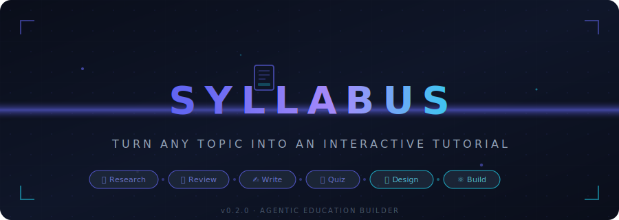

<p align="center">
  
</p>

<p align="center">
  <strong>Turn any topic into an interactive tutorial — powered by a single orchestrator agent with 6 specialist subagents.</strong>
</p>

<p align="center">
  No API keys. No external services. No wrapper code.<br/>
  Just <code>.agent.md</code> and <code>SKILL.md</code> files that tell your AI coding assistant how to research, write, design, and build a complete learning app.
</p>

---

## How It Works

```
You (in Copilot, switch to @Syllabus agent):
  "I want to learn fine-tuning SLMs to prepare for job interviews"

@Syllabus detects the phase, asks a clarifying question if needed, then:
  🔍 Curriculum Architect — web searches the topic, builds a syllabus
  🎯 Content Reviewer    — adjusts for your goals & level
  ✍️  Lesson Writer       — writes explanations, code examples, diagrams
  🧩 Quiz Master         — creates MCQs, coding challenges, scenarios
  🎨 UI Designer         — picks theme, designs the layout
  ⚛️  React Developer     — builds the full React app

Output: syllabus-output/ — a working Vite + React app with
        lessons, code playgrounds, quizzes, and progress tracking
```

**The key insight:** The user only talks to `@Syllabus`. The 6 specialist agents are invisible subagents that the orchestrator delegates to. There's no orchestration code — the `.agent.md` files ARE the software.

## Quick Start

```bash
# Install
npm install -g syllabus

# Add agents & skills to your project  
cd my-project
syllabus init

# Now switch to @Syllabus in Copilot Agent Mode and type:
"I want to learn fine-tuning SLMs to prepare for job interviews"

# @Syllabus orchestrates everything. When it's done:
cd syllabus-output && npm run dev
```

## What Gets Installed

```
syllabus init
```

Copies these files into your project:

```
.github/
├── copilot-instructions.md              ← Copilot reads this first
├── agents/
│   ├── syllabus.agent.md                ← Orchestrator (user-facing)
│   ├── curriculum-architect.agent.md    ← Subagent: researches & plans
│   ├── content-reviewer.agent.md        ← Subagent: reviews & adjusts
│   ├── lesson-writer.agent.md           ← Subagent: writes content
│   ├── quiz-master.agent.md             ← Subagent: creates assessments
│   ├── ui-designer.agent.md             ← Subagent: designs theme & layout
│   └── react-developer.agent.md         ← Subagent: builds the React app
└── skills/
    ├── web-research/SKILL.md            ← How to research topics
    ├── syllabus-design/SKILL.md         ← Bloom's taxonomy, module arcs
    ├── content-writing/SKILL.md         ← Writing formulas, code standards
    ├── quiz-generation/SKILL.md         ← Question types, difficulty curves
    ├── react-coding/SKILL.md            ← Vite + React + Tailwind patterns
    ├── design-system/SKILL.md           ← Themes, components, spacing
    ├── progress-tracking/SKILL.md       ← Progress data model & UX
    └── accessibility/SKILL.md           ← WCAG 2.1 AA checklist
CLAUDE.md                                ← Claude Code reads this
```

That's the entire system. No runtime dependencies. No server. No API keys.

## Architecture

### Single Orchestrator, Invisible Specialists

The user only interacts with `@Syllabus`. The 6 specialist agents have `user-invocable: false` in their frontmatter — they're hidden from the agent picker and only accessible as subagents.

```
User → @Syllabus (the only visible agent)
         │
         ├── Checks syllabus-output/ for existing files (state machine)
         ├── Asks 1 clarifying question if needed (BRIEF phase)
         │
         ├──→ @curriculum-architect (hidden subagent)
         ├──→ @content-reviewer     (hidden subagent)
         ├──→ @lesson-writer        (hidden subagent)
         ├──→ @quiz-master          (hidden subagent)
         ├──→ @ui-designer          (hidden subagent)
         └──→ @react-developer      (hidden subagent)
                  │
                  └── npm install && npm run build → verify
```

### File-Based State Machine

The orchestrator detects the current phase by checking which files exist in `syllabus-output/`. This means:
- **Resumable**: If interrupted, it picks up where it left off
- **Inspectable**: You can see exactly what was produced at each step
- **Restartable**: Delete a file to re-run that phase

### Skills = Shared Knowledge

Skills are reusable reference directories that agents load on demand:
- Each skill is a folder with a `SKILL.md` file (e.g., `.github/skills/web-research/SKILL.md`)
- Can include scripts, examples, and resources alongside the instructions
- Progressive loading: only the name/description is loaded initially, body loaded when relevant

## Works With

| Tool | How |
|------|-----|
| **GitHub Copilot** | Switch to `@Syllabus` agent in the agent picker |
| **Claude Code** | Reads `CLAUDE.md` → follows `syllabus.agent.md` |
| **Any AI coding assistant** | That reads `.md` files and has web search + file creation |

## Example Prompts

Once you've run `syllabus init`, switch to `@Syllabus` and try:

```
I want to learn fine-tuning SLMs to prepare for job interviews

Teach me Kubernetes from scratch, I'm a backend dev

Build a hands-on tutorial on React hooks with coding exercises

I need to understand system design for FAANG interviews  

Create a project-based course on building a CLI in Rust

Help me learn GraphQL — I know REST but not GraphQL
```

The AI infers depth, style, and goals from how you phrase it:
- "prepare for interviews" → interview-prep style
- "from scratch" → beginner depth  
- "hands-on" → hands-on style with code exercises
- "project-based" → capstone project included

## Customization

### Modify agents

Edit any `.agent.md` file in `.github/agents/` to change behavior:
- Want shorter tutorials? Edit `curriculum-architect.agent.md` module count guidelines
- Want more quizzes? Edit `quiz-master.agent.md` per-module targets
- Prefer Vue over React? Rewrite `react-developer.agent.md` for Vue

### Add new skills

Create a new directory in `.github/skills/` with a `SKILL.md` file:
```
.github/skills/my-skill/
  SKILL.md     ← Required, with name + description frontmatter
  template.js  ← Optional resources
```

### Change the output framework

The `react-developer.agent.md` agent builds React apps by default. Fork it to create:
- `vue-developer.agent.md` — Vue + Nuxt output
- `svelte-developer.agent.md` — SvelteKit output  
- `html-developer.agent.md` — vanilla HTML/CSS/JS output

## Philosophy

Most "AI agents" are Python scripts that wrap API calls with retry logic. Syllabus is different:

**The agents are markdown files.** They contain instructions, not code. The AI coding assistant reads them and follows them using its native capabilities.

**There's no runtime.** No server, no API keys, no dependencies to update.

**Single entry point.** The user talks to one agent. The complexity is invisible.

**Resumable pipeline.** File-based state means the pipeline can resume from any point.

## License

MIT
