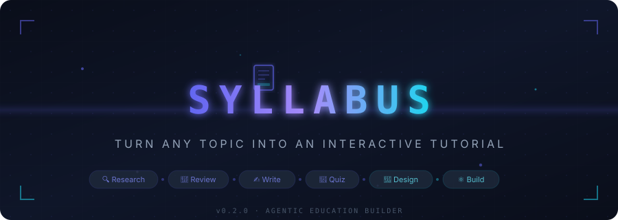

<p align="center">
  
</p>

<p align="center">
  <strong>Turn any topic into an interactive tutorial — with lessons, quizzes, audio narration, and a live URL — driven by a single orchestrator agent and a team of specialist subagents.</strong>
</p>

<p align="center">
  No API keys. No external services. No wrapper code.<br/>
  Just <code>.agent.md</code> and <code>SKILL.md</code> files that tell your AI coding assistant how to research, write, design, and build a complete learning app.
</p>

---

## How It Works

```
You (Copilot: @Syllabus agent · Claude Code: run `claude`):
  "I want to learn fine-tuning SLMs"

Syllabus detects the phase, asks a clarifying question if needed, then:
  🔍 Curriculum Architect — web searches the topic, builds a syllabus
  🎯 Content Reviewer    — adjusts for your goals & level
  ✍️  Lesson Writer       — writes explanations, code examples, diagrams
  🧩 Quiz Master         — creates MCQs, coding challenges, scenarios
  🎨 UI Designer         — picks theme, designs the layout & audio player
  ⚛️  React Developer     — builds the full React app with audio player
  🎙️ Narration Engineer  — generates audio MP3s for every lesson
  🔍 Quality Auditor     — audits & auto-fixes issues
  🚀 Deployer            — deploys live to Vercel/Netlify/Surge

Output: syllabus-output/ — a working Vite + React app with
        lessons, code playgrounds, quizzes, audio narration,
        progress tracking, and a live deployed URL
```

**The key insight:** The user only talks to `@Syllabus`. The 9 specialist agents are invisible subagents that the orchestrator delegates to. There's no orchestration code — the `.agent.md` files ARE the software.

## Quick Start

```bash
# Install
npm install -g @vahidrostami/syllabus

# Add agents & skills to your project
cd my-project
syllabus init
```

`syllabus init` asks which coding agent you use:

```
  Which coding agent are you using?

    1) GitHub Copilot   — .github/ agents, skills, hooks + .vscode settings
    2) Claude Code      — .claude/ agents, skills, settings + CLAUDE.md
    3) Both             — recommended

  Choose 1, 2, or 3 [3]:
```

Skip the prompt with a flag — handy in scripts, CI, or a devcontainer:

```bash
syllabus init --agent copilot   # GitHub Copilot only
syllabus init --agent claude    # Claude Code only
syllabus init --agent both      # both layouts
syllabus init --yes             # same as --agent both
```

Without a TTY (piped input, CI) `init` defaults to `both` instead of hanging on
the prompt. Nothing is ever overwritten, so re-running `init` after an upgrade
only fills in what's missing — delete a file first if you want it refreshed.

Then just describe what you want to learn:

```bash
# GitHub Copilot: switch to the @Syllabus agent, then type a topic.
# Claude Code:    run `claude` (or `claude --agent syllabus`), then type a topic:
"I want to learn fine-tuning SLMs"

# Syllabus orchestrates everything. When it's done:
cd syllabus-output && npm run dev
```

## What Gets Installed

Both layouts share one tool-neutral brief — **`AGENTS.md`** — which GitHub Copilot
loads automatically and Claude Code loads through `CLAUDE.md` (a one-line
`@AGENTS.md` import). One source of truth, read by both tools. Every choice also
gets `scripts/`, the deterministic pipeline steps the agents shell out to.

**GitHub Copilot** (`--agent copilot`):

```
AGENTS.md                                ← Shared, tool-neutral orchestration brief
scripts/
├── make-module-briefs.mjs               ← Slices the syllabus into per-module briefs
└── validate-course-data.mjs             ← Deterministic lesson + quiz gate
.github/
├── copilot-instructions.md              ← Short pointer to AGENTS.md + @Syllabus
├── agents/
│   ├── syllabus.agent.md                ← Orchestrator (user-facing)
│   ├── curriculum-architect.agent.md    ← Subagent: researches & plans
│   ├── content-reviewer.agent.md        ← Subagent: reviews & adjusts
│   ├── lesson-writer.agent.md           ← Subagent: authors ONE module (lessons + quiz)
│   ├── quiz-master.agent.md             ← Subagent: repairs quizzes the validator flags
│   ├── ui-designer.agent.md             ← Subagent: designs theme & layout
│   ├── react-developer.agent.md         ← Subagent: builds the React app
│   ├── narration-engineer.agent.md      ← Subagent: generates audio narration
│   ├── quality-auditor.agent.md         ← Subagent: audits & fixes issues
│   └── deployer.agent.md                ← Subagent: deploys to free hosting
├── hooks/                               ← Reliability guardrails (scripts)
└── skills/
    ├── web-research/SKILL.md            ← How to research topics
    ├── source-extraction/SKILL.md       ← Build a course from your own document
    ├── syllabus-design/SKILL.md         ← Bloom's taxonomy, module arcs
    ├── content-writing/SKILL.md         ← Writing formulas, code standards
    ├── quiz-generation/SKILL.md         ← Question types, difficulty curves
    ├── context-economy/SKILL.md         ← Sharding & read discipline (keeps runs cheap)
    ├── react-coding/SKILL.md            ← Vite + React + Tailwind patterns
    ├── design-system/SKILL.md           ← Themes, components, spacing
    ├── progress-tracking/SKILL.md       ← Progress data model & UX
    ├── accessibility/SKILL.md           ← WCAG 2.1 AA checklist
    ├── audit-automation/SKILL.md        ← Auto-fix patterns for auditing
    ├── audio-narration/SKILL.md         ← TTS, audio player, Web Speech
    └── deployment/SKILL.md              ← Free hosting providers
.vscode/settings.json                    ← Turns on agent hooks, points VS Code at .github/hooks
```

**Claude Code** (`--agent claude`) — the same agents & skills in Claude's native layout:

```
AGENTS.md                                ← Shared, tool-neutral orchestration brief
scripts/                                 ← The same two pipeline scripts
.claude/
├── agents/
│   ├── syllabus.md                      ← Orchestrator subagent
│   └── … + 9 specialist subagents (*.md)
├── settings.json                        ← Permissions + reliability hooks
└── skills/                              ← the same 13 SKILL.md guides
.github/hooks/scripts/                   ← shared reliability hook scripts
CLAUDE.md                                ← One line: @AGENTS.md
```

That's the entire system. No runtime dependencies. No server. No API keys.

## Architecture

### Single Orchestrator, Invisible Specialists

The user only interacts with the orchestrator (`@Syllabus`). The 9 specialist agents are hidden from the agent picker — Copilot marks them `user-invocable: false`, and Claude Code invokes them only through the Task tool. Either way, they run only as subagents.

```
User → @Syllabus (the only visible agent)
         │
         ├── Checks syllabus-output/ for existing files (state machine)
         ├── Asks 1 clarifying question if needed (BRIEF phase)
         │
         ├──→ @curriculum-architect (hidden subagent)
         ├──→ @content-reviewer     (hidden subagent)
         ├──  node scripts/make-module-briefs.mjs   → one small brief per module
         ├──→ @lesson-writer        (one invocation PER MODULE → lessons + quiz)
         ├──  node scripts/validate-course-data.mjs → deterministic gate
         ├──→ @quiz-master          (only for modules the gate flags)
         ├──→ @ui-designer          (hidden subagent)
         ├──→ @react-developer      (hidden subagent)
         ├──  npm install && npm run build → verify
         ├──→ @narration-engineer   (hidden subagent) → audio MP3s
         ├──→ @quality-auditor      (hidden subagent) → audit & fix
         └──→ @deployer             (hidden subagent) → live URL
```

### File-Based State Machine

The orchestrator detects the current phase by checking which files exist in `syllabus-output/`. This means:
- **Resumable**: If interrupted, it picks up where it left off
- **Inspectable**: You can see exactly what was produced at each step
- **Restartable**: Delete a file to re-run that phase

### Skills = Shared Knowledge

Skills are reusable reference directories that agents load on demand:
- Each skill is a folder with a `SKILL.md` file (e.g., `.github/skills/web-research/SKILL.md`)
- Can include scripts, examples, and resources alongside the instructions
- Progressive loading: only the name/description is loaded initially, body loaded when relevant

## Works With

| Tool | How |
|------|-----|
| **GitHub Copilot** | Switch to the `@Syllabus` agent (reads `AGENTS.md` automatically) |
| **Claude Code** | Run `claude` — `CLAUDE.md` imports `@AGENTS.md` — or `claude --agent syllabus` |
| **Any AI coding assistant** | Reads the standard `AGENTS.md` brief plus `.md` agent files; needs web search + file creation |

## Example Prompts

Once you've run `syllabus init`, start Syllabus (the `@Syllabus` agent in Copilot, or `claude` in Claude Code) and try:

```
I want to learn fine-tuning SLMs

Teach me Kubernetes from scratch, I'm a backend dev

Build a hands-on tutorial on React hooks with coding exercises

Create a project-based course on building a CLI in Rust

Help me learn GraphQL — I know REST but not GraphQL
```

The AI infers depth, style, and goals from how you phrase it:
- "from scratch" → beginner depth  
- "hands-on" → hands-on style with code exercises
- "project-based" → capstone project included

### Build a course from your own document

Syllabus can also build a course grounded in a document you provide — a white
paper, spec, book chapter, or internal doc — instead of web research:

```
Build a course from this white paper: ./docs/paper.pdf

Teach me everything in ~/Downloads/Day_1_v3.pdf

Turn this spec into a tutorial (I'll paste the text)
```

In this **source-grounded mode** the document is the source of truth: every
module, lesson, and quiz traces back to the document, with citations. The web is
used only to fill gaps (defining assumed terms, adding a missing runnable
example), and that supplemental content is clearly marked.

> The document must be a **local file** (PDF / Markdown / TXT / DOCX / EPUB /
> HTML) in your workspace or pasted text — login-gated links (Google Drive,
> Notion, SharePoint) can't be read, so download the file first.

## Customization

### Modify agents

Edit any agent file (`.github/agents/*.agent.md` for Copilot, `.claude/agents/*.md` for Claude Code) to change behavior:
- Want shorter tutorials? Edit `curriculum-architect.agent.md` module count guidelines
- Want more quizzes? Edit `lesson-writer.agent.md` (it writes them) or the syllabus `quiz` targets per module
- Prefer Vue over React? Rewrite `react-developer.agent.md` for Vue

### Pick a model per agent

Each specialist pins its own model in its frontmatter, so the expensive model is
spent only where it changes the result:

| Agent | Claude Code | GitHub Copilot | Why |
|---|---|---|---|
| `syllabus` (orchestrator) | `inherit` | model picker | Bookkeeping — follows your session |
| `lesson-writer` | `opus` | Opus | Lesson prose *is* the product |
| `curriculum-architect` | `sonnet` | Sonnet | Research + structure |
| `ui-designer` | `sonnet` | Sonnet | Design judgement |
| `react-developer` | `sonnet` | Sonnet | Structured, spec-driven code |
| `quiz-master` | `sonnet` | Sonnet | Rare repair pass |
| `content-reviewer` | `haiku` | Haiku | Checklist evaluation |
| `quality-auditor` | `haiku` | Haiku | Runs tools, reads results |
| `narration-engineer` | `haiku` | Haiku | Mechanical: JSON → TTS |
| `deployer` | `haiku` | Haiku | Mechanical: CLI + URL |

**This does not cost extra context.** A subagent starts in a fresh, isolated
context window — it never sees the orchestrator's history or the files the
orchestrator already read — and it keeps its own prompt cache. Giving one
specialist a different model re-sends nothing from the parent.

The one thing to avoid is changing the model of a **live conversation**
mid-pipeline. Prompt caches are keyed per model, so switching the orchestrator's
model discards its cache and re-bills the whole prefix. Pick your session model
once, before you start.

Two practical notes:

- Copilot model names are qualified as `Model Name (copilot)` and each agent
  lists a **prioritized array**, so if your org doesn't enable the first entry the
  next one is used. Adjust the names to match your model picker.
- Claude Code resolves `CLAUDE_CODE_SUBAGENT_MODEL` *above* the frontmatter.
  Leave it unset, or it overrides this routing for every specialist.
- A subagent's context window is sized by its own model. Small models have
  smaller windows — another reason each module brief stays small.

### Keep runs cheap

Most of a run's cost is context carried across turns, not content produced. The
pipeline is built around that: the WRITE phase fans out one small invocation per
module, and deterministic checks run as scripts so a model is only invoked for
what is actually broken. See `.github/skills/context-economy/SKILL.md` before
changing how phases are batched.

### Add new skills

Create a new directory in `.github/skills/` with a `SKILL.md` file
(`.claude/skills/` is a symlink to it, so Claude Code picks it up automatically):
```
.github/skills/my-skill/
  SKILL.md     ← Required, with name + description frontmatter
  template.js  ← Optional resources
```

### Change the output framework

The `react-developer.agent.md` agent builds React apps by default. Fork it to create:
- `vue-developer.agent.md` — Vue + Nuxt output
- `svelte-developer.agent.md` — SvelteKit output  
- `html-developer.agent.md` — vanilla HTML/CSS/JS output

## Philosophy

Most "AI agents" are Python scripts that wrap API calls with retry logic. Syllabus is different:

**The agents are markdown files.** They contain instructions, not code. The AI coding assistant reads them and follows them using its native capabilities.

**There's no runtime.** No server, no API keys, no dependencies to update.

**Single entry point.** The user talks to one agent. The complexity is invisible.

**Resumable pipeline.** File-based state means the pipeline can resume from any point.

## Audio Narration

Every lesson gets a spoken audio version — learners can listen while reading or on the go.

- **Edge TTS** (default) — Free Microsoft neural voices, no API key, no rate limits. Generates MP3 + VTT subtitle files at build time
- **Web Speech API** (fallback) — Browser-built-in, zero setup. Used when Edge TTS isn't available
- **Audio player** — Glass-morphism mini-player bar, full expanded view, mobile listen mode with lock-screen controls
- **Keyboard shortcuts** — Space (play/pause), ←/→ (skip 15s), [/] (speed), M (mute)

Configure in `syllabus.config.js`:
```js
audio: {
  enabled: true,
  provider: 'edge-tts',        // edge-tts | web-speech | none
  voice: 'en-US-AndrewMultilingualNeural', // Microsoft neural voice
  fallback: 'web-speech',
}
```

## Auto-Deployment

After the quality audit passes, your tutorial is deployed to free hosting automatically.

| Provider | Auth | Free Tier |
|----------|------|-----------|
| **Vercel** (default) | One-time OAuth or token | 100GB/mo bandwidth |
| **Netlify** | One-time OAuth or token | 100GB/mo bandwidth |
| **Surge** | Email only — zero friction | Unlimited |
| **GitHub Pages** | `gh` CLI (already authed) | 100GB/mo bandwidth |
| **Cloudflare Pages** | OAuth or token | Unlimited bandwidth |

Configure in `syllabus.config.js`:
```js
deploy: {
  enabled: true,
  provider: 'auto',    // auto | vercel | netlify | surge | github-pages | cloudflare
  autoPrompt: true,    // ask before deploying
}
```

After completion you get:
```
✅ Tutorial ready! (Quality score: 98/100)
   🖥️  Local:  cd syllabus-output && npm run dev
   🌐 Live:   https://learn-react-hooks.vercel.app
   🎧 Audio:  24 lessons narrated (~40 min)
```

## License

MIT
